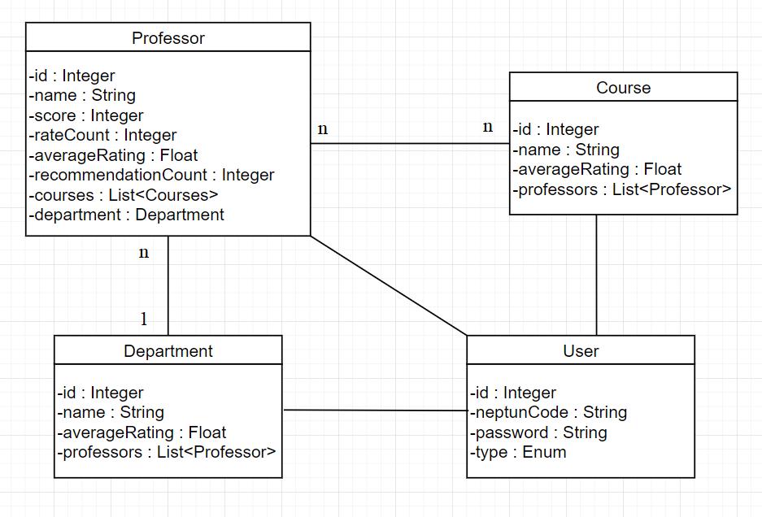
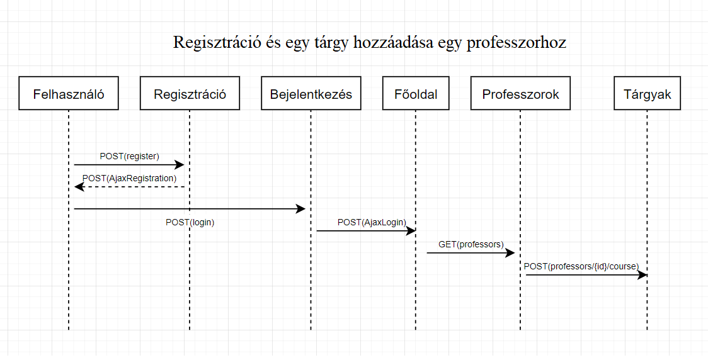

# ProfRate
<H1>Alkalmazások fejlesztése beadandó</H1>
<H3>Bevezető</H3>

Ez egy <b>egyszerű professzor/tárgy értékelő</b> oldal. (markmyprofessor-hoz hasonló), amelyben a felhasználónak értékelik a <b>tárgyakat, oktatókat</b>. 
Minden <b>oktatóhoz</b> tartozik egy <b>név</b>, egy <b>azonosító</b>, egy <b>pontszám</b> (ami több szempont szerinti alpontszámok átlaga) illetve az, hogy milyen tárgyakat oktat. 
Az oktatókhoz hasonlóan a <b>tárgyakhoz</b> tartozik egy <b>név</b>, egy <b>tárgyazonosító</b> valamint egy <b>pontszám</b>, illetve hogy melyik oktatók tanítják az adott tárgyat.  
Egy <b>nem regisztrált felhasználó</b> (<b>vendég</b>) meg tudja tekinteni az értékeléseket, viszont ahhoz, hogy ő maga is értékeljen már regisztráció szükséges. 
A <b>regisztrált felhasználó</b> (<b>tag</b>) tud <b>értékelni</b> és akár <b>megjegyzéseket</b> is irhat az adott oktatóhoz, tárgyhoz. Az értékelés többféle szempont alapján történik, majd az egyes szempontok átlaga fogja adni az adott tárgyhoz/oktatóhoz tartozó pontszámot. Ezen kívül lehetősége van <b>felvenni</b> egy oktatót (vagy tárgyat) a kedvencek közé. Ha egy oktató vagy tárgy nem szerepel az adatbázisban, akkor a felhasználó <b>hozzá tudja adni újként</b>, illetve minden felhasználó tudja <b>törölni</b> is a saját maga által hozzáadott rekordokat. 
Az <b>adminisztrátor</b> (<b>admin</b>) tud törölni bármilyen kommentet, oktatót és tantárgyat.

<H2>Követelményanalízis</H2>
<H3>Funkcionális követelmények</H3>
<ul>
  <li><b>Mindenki által elérhető funkciók:</b></li>
      <ul>
        <li>Regisztráció</li>
        <li>Tantárgyakhoz és oktatóhoz tartozó értékelések megjelenítése</li>
        <li>Tantárgyak és oktatók listázása értékelések átlaga alapján rendezve</li>
        <li>Keresés (tantárgyat vagy oktatót név alapján)</li>
        <li>Oktatók kilistázása tantárgy alapján</li>
        <li>Tantárgyak kilistázása oktatók alapján</li>
      </ul>
  <li><b>Tagok által elérhető funkciók:</b></li>
      <ul>
        <li>Oktatók értékelése több szempont alapján</li>
        <li>Tantárgyak értékelése több szempont alapján</li>
        <li>Tantárgyak és oktatók listázása értékelések átlaga alapján rendezve</li>
        <li>Megjegyzés, vélemény írása az adott oktatóról, tantárgyról</li>
        <li>Új oktató hozzáadása az adatbázishoz</li>
        <li>Új tantárgy hozzáadása az adatbázishoz</li>
      </ul>
    <li><b>Adminisztrátor:</b></li>
      <ul>
        <li>Kommentek törlése</li>
        <li>Oktató törlése az adatbázisból</li>
        <li>Tantárgy törlése az adatbázisból</li>
      </ul>
</ul>
<H3>Nem funkcionális követelmények</H3>
<ul>
  <li>Könnyen kezelhető, felhasználó barát felület</li>
  <li>Jelszavas azonosítás</li>
  <li>Keresés eredmények gyors, átlátható megjelenítése</li>
  <li>Nem megfelelő kommentek kiszűrése, törlése</li>
</ul>
<H3>Szakterületi fogalomjegyzék</H3>
<ul>
  <li><b>professzor</b>: egyetemen vagy főiskolán tanító, magas képzettséggel rendelkező tanár</li>
  <li><b>kurzus</b>: az a keret, amelyben a hallgatók meghatározott rend (előadás, gyakorlat, beadandó feladat) szerint gyarapíthatják tudásukat </li>
  <li><b>hallgató</b>: felső oktatási intézményben tanuló személy</li>
  <li><b>átlag</b>: n darab szám számtani közepe, úgy számoljuk ki, hogy összeadjuk az n darab számot, majd az összeget leosztjuk n-el</li>
  <li><b>komment</b>: hozzászólás, megjegyzés, általában lényegre törő és rövid terjedelmű.</li>
</ul>

<H3>Szerepkörök</H3>
<ul>
  <li><b>vendég</b>: nincs regisztrálva, csak megtekintheti az értékeléseket</li>
  <li><b>tag</b>: regisztrálva van, értékelhet és megjegyzéseket is írhat</li>
  <li><b>adminisztrátor</b>: lehetősége van törölni bármilyen értékelést és kommentet</li>
</ul>

<H2>Tervezés</H2>

<H3>Entitások</H3>
<ul>
  <li>Course
    <ul>
      <li>id (Integer)</li>
      <li>name (String)</li>
      <li>averageRating (Float)</li>
      <li>professors (List&lt;Professor&gt;)</li>
    </ul>
  </li>
  <li>Department
    <ul>
        <li>id (Long)</li>
        <li>name (String)</li>
        <li>averageRating (Float)</li>
        <li>professors (List&lt;Professor&gt;)</li>
    </ul>
  </li>
  <li>Professor
    <ul>
        <li>id (Integer)</li>
        <li>name (String)</li>
        <li>score (Integer)</li>
        <li>rateCount(Integer)</li>
        <li>averageRating (Float)</li>
        <li>recommendationCount (Integer)</li>
        <li>courses (List&lt;Course&gt;)</li>
        <li>department (Department)</li>
    </ul>
  </li>
  <li>User
    <ul>
      <li>id (Integer)</li>
      <li>neptunCode (String)</li>
      <li>password (String)</li>
      <li>type (Enum)</li>
    </ul>
  </li>
</ul>

<H3>UML Diagram</H3>

<H3>Könyvtárstruktúra</H3>
<H4>Backend</H4>
<ul>
  <li>controllers
    <ul>
      <li>CourseController.java</li>
      <li>DepartmentController.java</li>
      <li>ProfessorController.java</li>
      <li>UserController.java</li>
    </ul>
  </li>
  <li>entities
    <ul>
      <li>Course.java</li>
      <li>Department.java</li>
      <li>Professor.java</li>
      <li>User.java</li>
    </ul>
  </li>
  <li>repositories
    <ul>
      <li>CourseRepository.java</li>
      <li>DepartmentRepository.java</li>
      <li>ProfessorRepository.java</li>
      <li>UserRepository.java</li>
    </ul>
  </li>
  <li>security
    <ul>
        <li>AuthenticatedUser.java</li>
        <li>CustomBasicAuthenticationEntryPoint.java</li>
        <li>MyUserDetailsService.java</li>
        <li>WebSecurityConfig.java</li>
    </ul>
  </li>
  <li>ProfRate.java</li>
</ul>

<H3>Végpontok</H3>
<ul>
  <li>GET/
    <ul>
      <li>/courses: kurzusok megjelenítése
         <ul>
           <li>/:id : az adott id-hez tartozó kurzus megjelenítése</li>
         </ul>
      </li>
      <li>/departments: tanszékek megjelenítése
         <ul>
           <li>/:id : az adott id-hez tartozó tanszék megjelenítése</li>
           <li>/:id/professors: az adott id-hez tartozó tanszék professzorainak megjelenítése</li>
         </ul>
      </li>
      <li>/professors: professzorok megjelenítése
         <ul>
           <li>/:id : az adott id-hez tartozó professzorok megjelenítése</li>
           <li>/:id/courses: az adott id-hez tartozó professzor kurzusainak megjelenítése</li>
         </ul>
      </li>
      <li>/users: felhasználók megjelenítése
      </li>
    </ul>
  </li>
  <li>POST/
    <ul>
      <li>/course: kurzus hozzáadása</li>
      <li>/department: tanszék hozzáadása</li>
      <li>/professor: professzor hozzáadása</li>
    </ul>
  </li>
  <li>PUT/
    <ul>
      <li>/courses/:id : az adott id-hez tartozó kurzus módosítása</li>
      <li>/departments/:id : az dott id-hez tartozó tanszék módosítása</li>
      <li>/professor/:id : az adott id-hez tartozó felhasználó módosítása</li>
    </ul>
  </li>
  <li>DELETE/
    <ul>
      <li>/courses/:id : az adott id-hez tartozó kurzus törlése</li>
      <li>/departments/:id : az dott id-hez tartozó tanszék törlése</li>
      <li>/professor/:id : az adott id-hez tartozó felhasználó törlésea</li>
    </ul>
  </li>
</ul>

<H3>Szekvencia diagram</H3>

